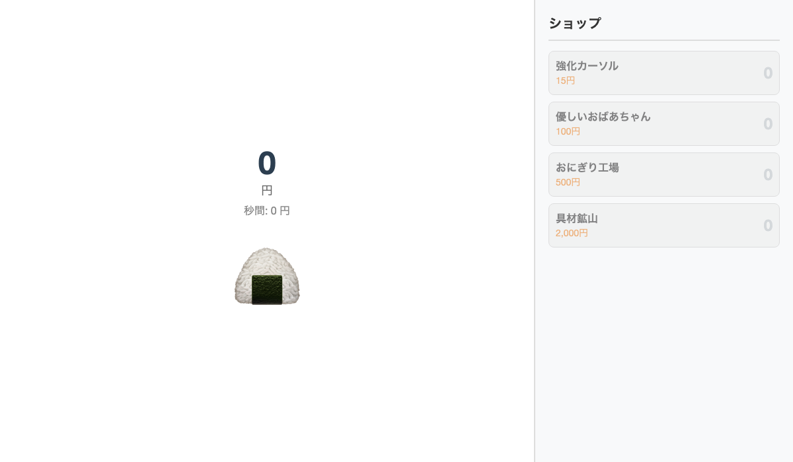
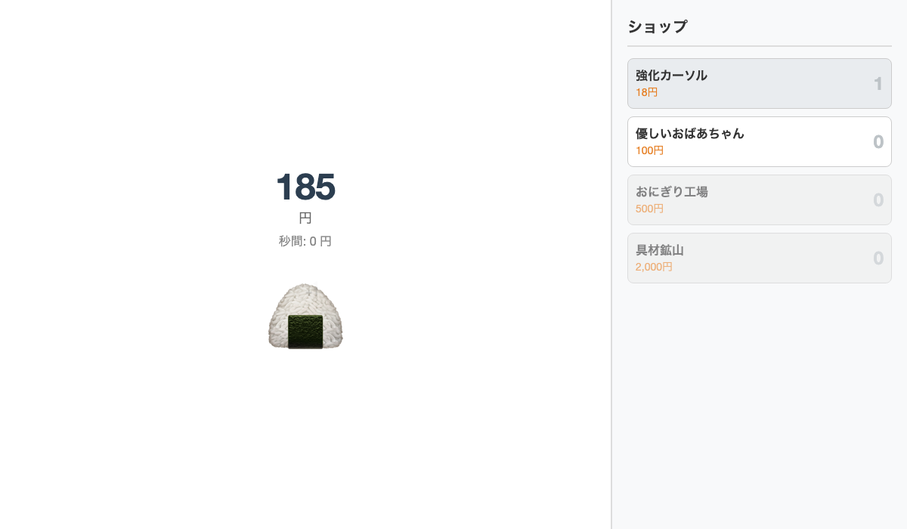

<!-- _class: lead -->

# Step 1

# クリッカーゲームで遊ぼう！

はじめてプログラムに触れる日

---

## 今日やること

| フェーズ | 内容                   | 時間 |
| -------- | ---------------------- | ---- |
| **Lv.1** | ゲームで遊んでみよう   | 15分 |
| **Lv.2** | コードをのぞいてみよう | 15分 |
| **Lv.3** | 自由に改造してみよう   | 30分 |

今日はコードを**書かなくて大丈夫**！
まずは気軽に触ってみよう。

---

<!-- _class: section-header -->

# Lv.1

## まず遊んでみよう 🍙

---

## ゲームを開いてみよう

`clicker/index.html` をブラウザで開いてみてください。



- 🍙 をひたすらクリック → お金が増えるよ！
- 右のショップでアイテムを買う → 自動でお金が増えていく

---

## 5分間、自由に遊んでみよう

気になったことは何でもメモしておこう！



> どうやったらお金が増えるの？
> アイテムを買うと何が変わる？
> 時間が経つと何か起きる？

---

## みんなに聞かせて！

### 「このゲーム、どんなゲームだった？」

気づいたことを自由に話してみよう。

- 正解・不正解はないよ
- どんな感想でもOK！
- 「よくわからなかった」も全然OK

---

<!-- _class: section-header -->

# Lv.2

## コードをのぞいてみよう 👀

---

## このゲーム、3つのファイルでできてるよ

| ファイル     | 役割   | 一言で言うと |
| ------------ | ------ | ------------ |
| `index.html` | 骨組み | 何を置くか   |
| `style.css`  | 見た目 | どう見せるか |
| `script.js`  | 動き   | どう動くか   |

> 全部読もうとしなくていい！
> **「なんとなくこんな感じか〜」くらいでOK。**

---

## index.html を開いてみよう

```html
<!-- ゲーム画面（左側） -->
<div class="game-area">
	<div id="score">0</div>
	<button id="clickBtn">🍙</button>
</div>

<!-- ショップ画面（右側） -->
<div class="shop-area">...</div>
```

→ ゲーム画面とショップを**並べているだけ**なんだ

---

## script.js を開いてみよう

```js
let money = 0; // 所持金
let clickPower = 1; // クリック1回で増える量
```

→ 数字をいくつか**持っているだけ**

全部わかろうとしなくていいよ。
**「ふーん、こんな感じか」で十分！**

---

## Lv.2 まとめ

- `index.html` → **画面の部品を並べてる**
- `style.css` → **色や大きさを決めてる**
- `script.js` → **数字を計算して画面を書き換えてる**

この3つがチームワークでゲームを動かしてるんだ。

---

<!-- _class: section-header -->

# Lv.3

## 自由に改造してみよう 🔧

---

## コードをいじると、ゲームが変わる！

`script.js` と `index.html` には、**いじりやすい場所**がたくさんある。

どこかを変えて、ゲームがどう変わるか試してみよう！

> 壊れても大丈夫！
> **保存しなければ元に戻せるよ。どんどん試してみて！**

---

## ヒント

**script.js を開いてみよう**

```js
let clickPower = 1; // ← この数字を変えたら？
```

```js
{ name: "強化カーソル", price: 15 } // ← name や price を変えたら？
```

**index.html を開いてみよう**

```html
<button id="clickBtn">🍙</button>
<!-- ← 絵文字を変えたら？ -->
<div class="unit">円</div>
<!-- ← 「円」を変えたら？ -->
```

---

## 自由時間（10〜15分）

ルールは1つだけ！

> **変えた場所と、変わった結果をメモしておこう**

正解なんてない。思いっきり好きにいじってみよう！

---

## みんなに見せて！

### 「どこを変えて、何が起きた？」

面白い改造ができた人、ぜひ教えてください！

---

## Step 1 おつかれさま！ 🎉

- HTML・CSS・JS の3ファイルでゲームが動いてたね
- コードの数字や文字を変えると、ゲームの動きが変わった！

**Step 2 では、このゲームで使われてる技術を**
**1つずつ一緒に学んでいくよ。**
